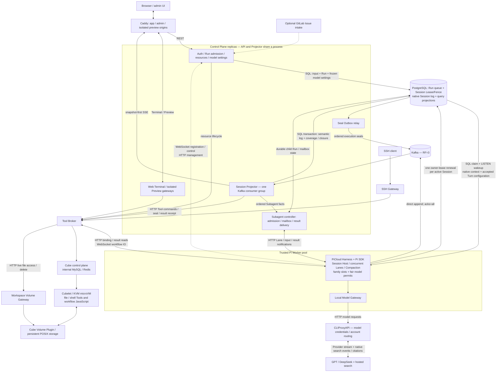

# PiCloud

A self-hosted, multi-tenant Cloud Coding Agent built on Pi's public SDK.
Pi runs in a trusted Worker pool; model-generated file and shell operations run
in CubeSandbox KVM microVMs. Provider credentials stay in CLIProxyAPI, outside
the guest environment.

## Features

- Chinese/English Web UI, native multi-round conversations, Compaction, Fork,
  tree navigation, Steer and cursor-free streaming recovery;
- per-conversation Provider/model/reasoning settings and GPT Fast mode, frozen
  for each accepted Turn; native Web Search on GPT and DeepSeek Pro;
- recursive Subagents with bounded depth and concurrency: inherited or empty
  Lanes share a physical Pi Session and Volume, with shared or temporary compute;
- elastic Workspaces and named, user-owned development machines;
- live file browsing, Web Terminal, machine SSH and authenticated application previews;
- optional GitLab Issue intake and environment-local GitLab/GitHub credentials;
- replaceable Workers, PostgreSQL Run scheduling and Kubernetes/KEDA deployment.

This targets private or controlled enterprise deployments, not hostile public SaaS.
Recovery preserves conversation meaning and reports uncertain Tool effects;
it does **not** automatically replay arbitrary shell commands or restore lost process memory.

Subagent control requests follow the ordered Kafka log. Workflow JavaScript runs
inside Cube, never in the trusted Worker or Projector. See [Subagents](docs/SUBAGENTS.md)
for the execution contract and its recovery limits.

## Architecture



Solid arrows show logical calls or data flow, not additional services. Workers
claim child Runs from the same PG queue as ordinary Runs; the Subagent controller
wakes the owning Worker but does not run another scheduler. Workflow scripts run
inside Cube and send `runs.*` requests back through the Worker → Kafka path.
Operator monitoring and one-host network relays are optional/supporting paths,
not transcript storage or execution authorities.

PostgreSQL accepts input before acknowledging it. Workers claim ready Runs from
the same queue; notifications only reduce idle latency. A cold Session occupies
no slot. All active Lanes of one physical Pi Session share one Worker and owner
lease. A later Turn can move to another Worker once that ownership ends; an
active child is not independently placed on a different Worker. Each family
uses one slot, while model calls use separate permits released before Tool/child
waits. Cold restore loads native context from the latest Compaction, not lifetime
JSONL. Compaction itself runs in the trusted Harness through the model route.
Workers call the embedded SDK rather than starting a Pi CLI process per message.
Delegated child views use separate Lanes in the same native Session; a human
conversation Fork creates an independent native Session.

Model selection is not Worker-local state: `sessions` holds the desired
provider/model/reasoning/Fast selection, and acceptance freezes it in `turns`.
The claimant reads that Turn snapshot. The current UI/API requires queued/running
Turns to finish before changing selection. CLIProxyAPI owns model-account
credentials and routing, not the conversation's chosen model. Hosted search runs
at the provider; activity and supported native search/citation history return
through the Worker adapter and the same execution log.

Workers stamp native records before appending directly to Kafka. One partitioned
Projector group checks recorded openings/seals, projects complete semantic data to
PG, maintains the live view, and routes Tool commands to the owning executor.
There is no Fact Gateway, second scheduler, separate live/Tool consumer group,
record signature or per-token PG authority query. Ordinary Steps return at Kafka
ACK rather than waiting for a PG projection receipt.

A browser opens a materialized snapshot of complete history plus pending output,
then receives new SSE events. Complete native messages and display coverage commit
together, allowing covered fragments to leave memory before Run end. Snapshots are
framed; interrupted values are discarded. The browser holds no Kafka cursor.
Requests on a non-owning API replica proxy to the partition owner. History opens
on the latest 40 Turns and older pages load on demand.

Complete model output and validated Tool intent have separate native durability
boundaries. Concrete commands also require Kafka publication and Broker admission;
the Projector does not wait for guest execution. Raw results return to the Worker
for Harness processing, then the native Tool Result follows the same Kafka path
and retires the Broker's bounded retry copy. Platform Tools and provider-hosted
search do not become arbitrary guest shell commands.

At settlement, PG requests an ordered Kafka seal. Projector commits the terminal
and any uncovered interrupted text before a successor can restore context. Late
records after closure cannot affect history, UI or new Tool dispatch. Already-issued
Cube effects may remain UNKNOWN: this is semantic recovery, not exactly-once shell
execution or restoration of lost process memory. Kafka retention follows safe PG
recovery progress plus a grace interval; token fragments do not become PG rows.

A cancellation-cleanup failure does not permanently strand the conversation:
after positive Agent exit and committed seal, the same Session may accept a new
Run. The failed Run is retained, never automatically replayed.

Workspace files belong to persistent Cube Volumes, without per-Run archives or
settlement heads. Sessions can share an elastic Workspace and its warm Cube;
user-owned machines have an independent lifecycle and Sessions select directories
inside them. A Subagent may mount the same Volume in a temporary independent Cube
and select an existing working directory. The Agent manages Git worktrees and
merges with ordinary Git; PiCloud does not copy child Workspaces. Machine snapshots
are node-affine. Deleting a resource preserves its
conversations but requires rebinding before further work. Browsing reads current
files; it does not invoke the Agent or replay its log. Raw Tool output is bounded,
not archived. Cube's MySQL/Redis manage Cube, not PiCloud Runs.
The Cube Volume Plugin initializes storage; the Volume Gateway only verifies its
immutable identity and serves current files. No second Workspace initialization
or per-Run storage head lives in the Gateway.

| Concern | Source of truth / disposable state |
| --- | --- |
| Resource ownership, Run queue, Session Lease/Fence, model selection | PostgreSQL |
| Accepted output before safe reclamation | Kafka |
| Long-term native Session history and cold restore | Durable PostgreSQL projection |
| Active Lane context and browser streaming tail | Rebuildable Worker / Projector memory |
| Workspace files / running processes | Volume / live Cube or surviving VM snapshot |
| Model-account credentials | CLIProxyAPI |

Optional GitLab and Prometheus/Grafana/Alertmanager/Jaeger integrations are outside
the scheduling/log authorities. One-host relays supply network reachability,
not additional event-processing stages.

See [Architecture](docs/ARCHITECTURE.md), [Run lifecycle](docs/RUN_LIFECYCLE.md),
[stream durability](docs/STREAM_DURABILITY.md) and
[deployment](docs/PRODUCTION_DEPLOYMENT.md) for implementation boundaries.

## One-host deployment

Requirements: x86_64 Debian/Ubuntu or WSL2 with systemd, writable `/dev/kvm`,
at least 16 GiB RAM and 40 GiB free disk.

```bash
./install.sh --check-only
./install.sh
```

The installer can supply Docker, K3s, Node.js, Helm and the pinned Cube runtime.
It does not request model credentials or administrator passwords.

1. Open `http://127.0.0.1:8080` and register an account.
2. Promote the administrator, then restart Control Plane:

   ```bash
   npm run production:administrator -- --username <registered-username>
   ```

3. Open the administrator site at `http://127.0.0.1:8081` (local default; public
   product/admin origins are configured in the deployment settings). Configure model routes
   and Cube networking; follow its link to the Provider Gateway on port `8318`
   for subscription/API credentials. Retrieve the management key with
   `npm run production:provider-gateway:key`.
4. Create an elastic Workspace or a cloud development machine under **开发资源**,
   then start a conversation. Pure chat does not activate Cube.

Optional Code Host credentials are written to the selected environment, not the
conversation database. GitLab Issue intake is separate, deployment-controlled
integration. Users select a Workspace and explicitly start the ordinary Run;
the Agent clones the repository and only commits/publishes/closes Issues when
asked. See [the GitLab lab](deploy/gitlab/README.md).

Application previews use an authenticated, isolated `*.preview.localhost` origin
and support HTTP/WebSocket streaming, Vite and HMR. For remote deployment,
configure wildcard DNS/TLS for `*.preview.<application-host>`; a guest's localhost
is never the user's public application URL. SSH is available for user-owned machines.

Configuration and credentials live under the private `deploy/production/runtime/`
directory. Read [configuration](docs/CONFIGURATION.md) and
[deployment](docs/PRODUCTION_DEPLOYMENT.md) before changing public addresses,
storage, timeouts or capacity.

```bash
npm run production:ps
npm run production:logs
npm run production:config
npm run production:up:observability
npm run production:down
```

**Existing installations:** this pre-release protocol cutover is not a rolling
upgrade. Drain Runs, project all seals/Outbox, back up and release old runtime
instances, then stop the old execution services. Apply the current migrations and deploy
matching Worker, Control Plane/Projector and Broker images. New records use the
v8 Kafka topic and task execution references; there is no old-wire decoder.
Migration 141 also requires deliberate retirement of old isolated child Workspace
copies before the shared-Volume compute cutover; it never relabels or deletes them.
PG semantic history, identities and configuration are not reset by migration.
Remove the retired v7 topic only after confirming its complete projection.

## Kubernetes

The Helm chart expects external PostgreSQL/PgBouncer, Kafka, shared Workspace
storage and Cube control/compute authorities. Replace the example endpoints,
images, UUIDs and CIDRs before deployment:

```bash
cp deploy/helm/pi-cloud-platform/values.distributed.example.yaml values.yaml
npm run kubernetes:distributed:render -- --values values.yaml
npm run kubernetes:distributed:preflight -- --values values.yaml
npm run kubernetes:distributed:deploy -- --values values.yaml
```

KEDA scales Worker replicas from active/starting/ready Session families; PostgreSQL claim remains
the only scheduler. See [distributed deployment](docs/DISTRIBUTED_DEPLOYMENT.md).

## Verification

```bash
npm ci --ignore-scripts
npm run dependencies:harden
npm run check
npm run runtime-policy:check
npm run helm:check
```

Live checks consume model tokens and Cube capacity and require explicit opt-in:

```bash
PI_CLOUD_LIVE_CUBESANDBOX_CHECK=1 npm run production:check
PI_CLOUD_LIVE_SUBAGENT_CHECK=1 npm run production:subagents-check
PI_CLOUD_LIVE_LONG_CONTEXT_CHECK=1 npm run production:long-context-check
PI_CLOUD_LIVE_SNAKE_PREVIEW_CHECK=1 npm run production:snake-preview-check
```

[Evaluation](docs/EVALUATION.md) lists the wider suite. Reports are evidence for
their named revision and topology, not timeless throughput or HA guarantees.

## Documentation

[Map](docs/README.md) · [Configuration](docs/CONFIGURATION.md) ·
[Threat model](docs/THREAT_MODEL.md) · [Cube](docs/CUBESANDBOX_PROVIDER.md) ·
[Subagents](docs/SUBAGENTS.md) ·
[ADRs](docs/adr/README.md) · [Roadmap](docs/ROADMAP.md) · [Backlog](docs/BACKLOG.md)
